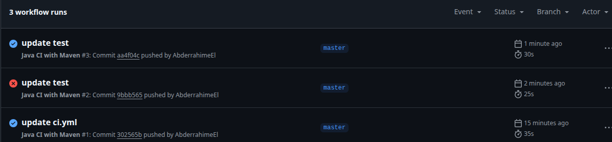

# Application de Gestion des Tâches (Todo App)

## Aperçu du Projet
Cette application est une plateforme de gestion des tâches qui permet aux utilisateurs de créer, suivre et gérer leurs tâches quotidiennes. Elle offre une interface API RESTful pour interagir avec le système.

## Technologies Utilisées
- **Java 17** - Langage de programmation principal
- **Spring Boot** - Framework pour le développement d'applications Java
- **Spring Security** - Pour l'authentification et l'autorisation
- **JWT (JSON Web Tokens)** - Pour la gestion des sessions utilisateur
- **MySQL** - Base de données relationnelle
- **Docker** - Pour la conteneurisation de l'application
- **Maven** - Outil de gestion de dépendances et de build

## Fonctionnalités
- **Authentification des utilisateurs** - Inscription et connexion
- **Gestion des tâches** - Création, consultation et mise à jour des tâches
- **Statuts des tâches** - Suivi de l'état des tâches (À faire, En cours, Terminé)
- **Rôles utilisateurs** - Différents niveaux d'accès (Utilisateur, Administrateur)
- **Sécurité** - Protection des endpoints API avec JWT

## Configuration et Installation

### Prérequis
- Java 17
- Docker et Docker Compose
- Maven

### Installation
1. Clonez le dépôt:
   ```
   git clone https://github.com/AbderrahimeEl/todo-app
   cd todo-app
   ```

2. Construisez l'application avec Maven:
   ```
   mvn clean package
   ```

3. Lancez l'application avec Docker Compose:
   ```
   docker-compose up -d
   ```

L'application sera accessible à l'adresse: http://localhost:8080

## Utilisation

### API Endpoints


## Structure du Projet
L'application suit une architecture en couches:
- **Controller** - Gestion des requêtes HTTP
- **Service** - Logique métier
- **Repository** - Accès aux données
- **Entity** - Modèles de données
- **Security** - Configuration de sécurité et authentification

## Déploiement
L'application est configurée pour être déployée facilement avec Docker. Le fichier docker-compose.yml définit deux services:
- **app** - L'application Spring Boot
- **mysql** - La base de données MySQL

## Intégration Continue et Tests
L'application utilise GitHub Actions pour l'intégration continue (CI). Le pipeline CI est configuré pour s'exécuter automatiquement à chaque push sur la branche master et pour chaque pull request.

### Pipeline CI
Le pipeline d'intégration continue comprend les étapes suivantes:
1. **Checkout du code** - Récupération du code source depuis le dépôt
2. **Configuration de JDK 17** - Installation et configuration de l'environnement Java
3. **Build avec Maven** - Compilation et packaging de l'application
4. **Exécution des tests** - Lancement des tests automatisés
5. **Construction de l'image Docker** - Création d'une image Docker de l'application (uniquement lors des pushes sur master)

